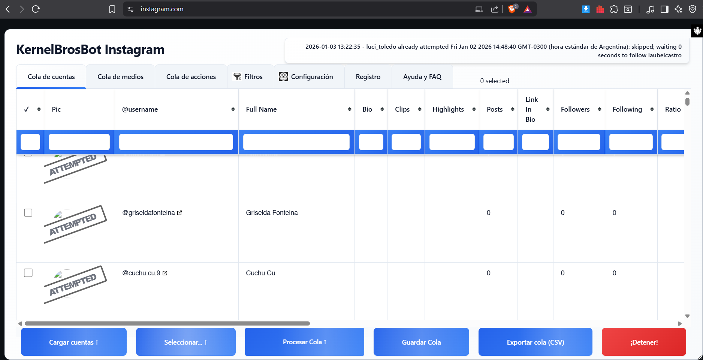
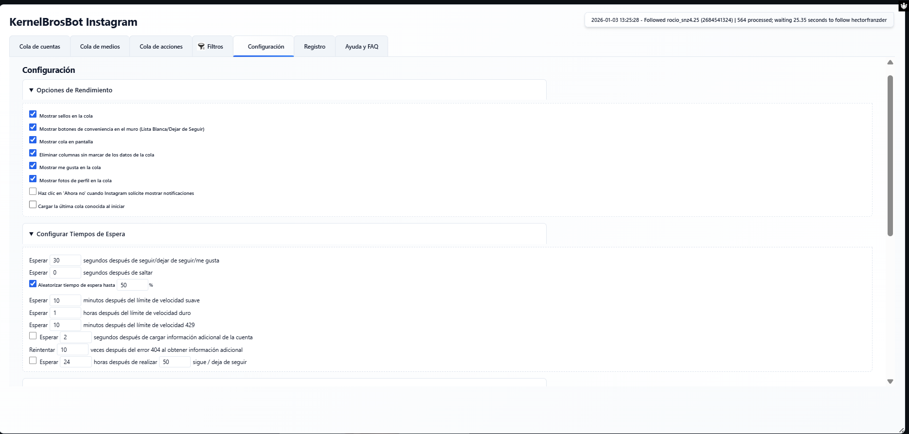

# KernelBros IgBot

## 📋 Descripción

**KernelBros IgBot** es una extensión de navegador (Chrome/Chromium) diseñada para automatizar tareas de gestión de cuentas en Instagram. Permite a los usuarios gestionar de manera eficiente sus actividades en la plataforma, tales como seguimientos, dejar de seguir, likes automáticos y más, sin necesidad de realizar estas acciones manualmente.

La extensión es ideal para:
- **Gestores de comunidades**: Automatizar el crecimiento y gestión de cuentas
- **Influencers y creadores de contenido**: Optimizar el tiempo dedicado a tareas repetitivas
- **Especialistas en marketing digital**: Implementar estrategias de engagement automatizadas
- **Administradores de redes sociales**: Gestionar múltiples cuentas de forma centralizada

> **Nota**: Este proyecto es una herramienta de automatización y debe utilizarse de conformidad con los Términos de Servicio de Instagram.

---

## ✨ Características Principales

- **Gestión de Colas de Cuentas**: Cargar, organizar y gestionar listas de cuentas para procesar
- **Cargar Cuentas Automáticamente**:
  - Desde listas guardadas
  - Desde lista blanca (cuentas a nunca dejar de seguir)
  - De personas que dieron like a tus publicaciones
  - De personas que comentaron en tus publicaciones
  - De personas etiquetadas en tus publicaciones
  - De los seguidos de una cuenta específica
  - De los seguidores de una cuenta específica
  - De solicitudes pendientes de seguimiento

- **Procesamiento de Colas con Múltiples Acciones**:
  - Seguir cuentas
  - Dejar de seguir cuentas
  - Dar like automáticamente a publicaciones recientes
  - Seguir + Like en combinación
  - Eliminar seguidores
  - Bloquear cuentas

- **Sistema Avanzado de Filtros**:
  - Filtrar por cantidad de seguidores/seguidos
  - Filtrar por ratio de engagement
  - Filtrar por contenido de biografía
  - Filtrar por tipo de cuenta (verificada, empresarial, privada)
  - Filtrar por actividad reciente
  - Filtros personalizables y reutilizables

- **Gesión de Lista Blanca**: Proteger cuentas específicas para nunca dejarlas de seguir

- **Selección y Operaciones Avanzadas**:
  - Seleccionar/deseleccionar cuentas individuales o en lote
  - Invertir selección
  - Eliminar cuentas seleccionadas de la cola

- **Programación de Acciones**: Programar acciones para ejecutarse en momentos específicos

- **Registro Detallado**: Seguimiento completo de todas las acciones realizadas con timestamps

- **Interfaz de Ayuda y FAQ**: Documentación integrada en la extensión

- **Soporte Multiidioma**: Interfaz disponible en español (es) por defecto

---

## � Capturas de Pantalla

### Página de Inicio (Home)
Interfaz principal del bot con acceso a todas las funcionalidades:



### Configuración (Settings)
Panel de configuración avanzada de la extensión:



### Registro y Historial
Visualización detallada de todas las acciones ejecutadas:


---

## �🛠️ Tecnologías Utilizadas

### Lenguajes y Frameworks
- **JavaScript (ES6+)**: Lenguaje principal de la extensión
- **HTML5**: Estructura de la interfaz de usuario
- **CSS3**: Estilos y temas visuales

### Librerías y Herramientas
- **jQuery 3.x**: Manipulación del DOM y utilidades
- **jQuery UI**: Componentes de interfaz avanzada
- **jQuery Tablesorter**: Ordenamiento y filtrado de tablas
- **noUiSlider**: Controles deslizantes para rangos
- **wNumb**: Formateador numérico para sliders

### Arquitectura de la Extensión
- **Manifest v3**: Versión más reciente del formato de extensiones de Chrome
- **Background Service Worker**: Script que se ejecuta en segundo plano
- **Content Script**: Script inyectado en las páginas de Instagram
- **Chrome Storage API**: Almacenamiento persistente de datos
- **Chrome Tabs API**: Gestión de pestañas del navegador
- **Chrome Runtime API**: Comunicación entre scripts

---

## 📁 Estructura del Proyecto

```
KernelBrosEx/
├── manifest.json                      # Configuración principal de la extensión (v3)
├── backgroundscript.js                # Script de fondo (service worker)
├── contentscript.js                   # Script inyectado en Instagram (8427 líneas)
├── contentscript.css                  # Estilos para el contenido inyectado
├── kernelbros.html                    # HTML base de la interfaz (465 líneas)
├── products.css                       # Estilos de productos/interfaz
├── theme.blue.css                     # Tema visual azul
├── jquery3.js                         # jQuery 3.x
├── jquery-ui.js                       # jQuery UI (componentes)
├── jquery-ui.css                      # Estilos jQuery UI
├── jquery.tablesorter.js              # Plugin para ordenar tablas
├── jquery.tablesorter.widgets.js      # Widgets adicionales del tablesorter
├── widget-pager.js                    # Paginador de tablas
├── nouislider.js                      # Slider de rango
├── nouislider.css                     # Estilos del slider
├── wNumb.js                           # Formateador numérico
├── winvars.js                         # Variables globales de la extensión
├── _locales/
│   └── es/
│       └── messages.json              # Mensajes y traducciones al español (519 líneas)
├── icon_128.png                       # Icono 128x128px
├── icon_48.png                        # Icono 48x48px
├── icon_16.png                        # Icono 16x16px
└── README.md                          # Este archivo

```

### Descripción de Archivos Clave

| Archivo | Propósito |
|---------|-----------|
| `manifest.json` | Define la configuración de la extensión: permisos, scripts, CSP, versión |
| `backgroundscript.js` | Service worker que maneja eventos globales y comunicación entre pestañas |
| `contentscript.js` | Script principal inyectado en Instagram; contiene toda la lógica de automatización |
| `kernelbros.html` | Define la estructura de la interfaz UI con tabs para diferentes funcionalidades |
| `_locales/es/messages.json` | Diccionario de traducción español para la interfaz |

---

## 📦 Instalación

### Requisitos Previos
- Navegador basado en Chromium (Chrome, Edge, Brave, etc.)
- Acceso a la página de extensiones de tu navegador

### Pasos de Instalación

#### 1. **Preparar la Carpeta del Proyecto**
```bash
# Clone o descargue el proyecto
cd c:\Users\gallo\Desktop\KernelBrosEx
```

#### 2. **Activar el Modo de Desarrollador**
- Abre tu navegador Chromium (Chrome, Edge, etc.)
- Navega a `chrome://extensions/` (o equivalente en tu navegador)
- Activa el **Modo de desarrollador** (esquina superior derecha)

#### 3. **Cargar la Extensión sin Empaquetar**
- Haz clic en **"Cargar extensión sin empaquetar"**
- Selecciona la carpeta `KernelBrosEx`
- La extensión debería aparecer en la lista

#### 4. **Verificar la Instalación**
- Deberías ver "KernelBros IgBot" en tu lista de extensiones
- El icono de la extensión aparecerá en la barra de herramientas

### Verificación Posterior a la Instalación
1. Navega a cualquier página de Instagram (instagram.com)
2. Verifica que el panel de control de la extensión aparezca (inyectado en la página)
3. Confirma que los tabs estén disponibles (Cola de cuentas, Cola de medios, etc.)

---

## 🚀 Uso

### Inicio Rápido

#### 1. **Acceder a la Interfaz**
- Al navegar a Instagram, la interfaz de KernelBros IgBot se inyectará automáticamente
- Busca el panel lateral izquierdo con el encabezado "KernelBrosBot Instagram"
- El estado inicial mostrará: "Listo para aceptar comandos"

#### 2. **Cargar Cuentas** (Tab: Cola de cuentas)
```
Paso 1: Haz clic en "Cargar cuentas ⬆"
Paso 2: Selecciona una opción:
  - Cargar lista blanca: Carga tu lista de cuentas protegidas
  - Cargar solicitudes pendientes: Carga follow requests no aprobados
  - Cargar cuentas desde cola de medios: Obtiene cuentas relacionadas a tus posts
  - Cargar quienes dieron like: Extrae usuarios que han dado like
  - Cargar quienes comentaron: Extrae usuarios que han comentado
  - Cargar seguidos de la página actual: Obtiene los seguidos de una cuenta específica
  - Cargar seguidores de la página actual: Obtiene los seguidores de una cuenta
  - Cargar cola: Restaura una cola previamente guardada
```

#### 3. **Aplicar Filtros** (Tab: Filtros)
```
Paso 1: Ve a la pestaña "Filtros"
Paso 2: Configura los criterios deseados:
  - Rango de seguidores/seguidos
  - Ratio seguidos/seguidores
  - Palabras clave en biografía (incluir/excluir)
  - Tipo de cuenta (verificada, empresarial, privada)
  - Últimas actividades
Paso 3: Haz clic en "Aplicar Filtros a Cola Actual"
```

#### 4. **Procesar la Cola** (Tab: Cola de cuentas)
```
Paso 1: Selecciona la acción deseada:
  - Seguir: Seguir todas las cuentas
  - Seguir + Like: Seguir y dar like a N publicaciones recientes
  - Solo Like: Solo dar like sin seguir
  - Dejar de seguir: Dejar de seguir las cuentas
  - Eliminar seguidor: Eliminar usuarios de tus seguidores
  - Bloquear: Bloquear cuentas

Paso 2: Haz clic en "Procesar cola ⬆"
Paso 3: El bot comenzará a ejecutar las acciones automáticamente

Nota: Se respetarán los tiempos de espera para evitar límites de velocidad de Instagram
```

### Ejemplos de Uso Común

#### Ejemplo 1: Crecimiento Orgánico Basado en Engagement
```
1. Cargar cuentas: "Cargar quienes dieron like" en tus posts recientes
2. Aplicar filtros:
   - Mínimo de 500 seguidores
   - Máximo de 10,000 seguidores (cuentas similares)
   - Incluir cuentas verificadas (opcional)
3. Procesar cola con acción: "Seguir"
```

#### Ejemplo 2: Limpieza de Seguidos No Recíprocos
```
1. Cargar cuentas: "Cargar seguidos de la página actual"
2. Aplicar filtros:
   - Ratio Seg/Seguidores > 2 (no te siguen de vuelta)
3. Procesar cola con acción: "Dejar de seguir"
```

#### Ejemplo 3: Interacción Selectiva con Audiencia
```
1. Cargar cuentas: "Cargar seguidores de la página actual"
2. Aplicar filtros:
   - Exluir cuentas privadas
   - Biografía contiene palabras clave relevantes
3. Procesar cola con acción: "Seguir + Like" (2 fotos)
```

### Gestión de Listas Blancas

La **lista blanca** protege cuentas específicas para nunca dejarlas de seguir:

```
1. Ve a la pestaña "Cola de cuentas"
2. Carga cualquier cola de cuentas
3. Selecciona las cuentas a proteger
4. Haz clic en "Seleccionar... ⬆" → "Agregar seleccionados a lista blanca"
5. Estas cuentas nunca serán deseleccionadas en acciones futuras de "Dejar de seguir"
```

### Programación de Acciones

La extensión permite programar acciones para ejecutarse automáticamente:

```
1. Ve a la pestaña "Configuración"
2. Define los tiempos de ejecución deseados
3. Selecciona las acciones y la cola a procesar
4. El bot ejecutará automáticamente a los horarios programados
```

### Visualización de Registros

Para revisar todas las acciones realizadas:

```
1. Ve a la pestaña "Registro"
2. Consulta la tabla de acciones programadas/ejecutadas
3. Cada entrada muestra:
   - Número secuencial
   - Función ejecutada
   - Hora programada
   - Hora de ejecución real
   - Frecuencia (si es diaria o única)
```

---

## ⚙️ Configuración

### Configuración de la Extensión (manifest.json)

#### Permisos Requeridos
```json
{
  "permissions": [
    "tabs",           // Para crear y gestionar pestañas
    "scripting",      // Para inyectar scripts
    "storage",        // Para almacenar datos locales
    "unlimitedStorage" // Para permitir almacenamiento sin límite
  ]
}
```

#### Sitios Permitidos
```json
{
  "host_permissions": [
    "https://*.instagram.com/*",        // Todas las variantes de Instagram
    "https://*.kernelbros.com.ar/*"     // Dominio de servidor KernelBros
  ]
}
```

#### Content Security Policy
```
- object-src 'self'
- script-src 'self'
- frame-src 'self' https://www.kernelbros.com.ar
```

### Variables de Entorno Implícitas

Las siguientes variables se utiliza internamente:

| Variable | Descripción |
|----------|-------------|
| `gbUserGuid` | GUID del usuario almacenado en localStorage |
| `gblActionsQueue` | Cola de acciones programadas |
| `gblIgBotUser` | Objeto del usuario actual |
| `gblActionsRunnerInterval` | Intervalo de ejecución del runner |

### Configuración de Interfaz (kernelbros.html)

#### Temas Disponibles
- **theme.blue.css**: Tema azul por defecto (personalizable)

#### Idioma por Defecto
- **es** (Español): Definido en `manifest.json` bajo `"default_locale": "es"`

---

## 🔒 Seguridad y Consideraciones

### Almacenamiento de Datos
- Todos los datos se almacenan localmente en `chrome.storage.local`
- Se envía información de usuario a servidores de KernelBros para validación de licencias
- El GUID de usuario y datos de estadísticas se sincroniza con el servidor
- El GUID de usuario se mantiene en localStorage para autenticación

### API Endpoints Utilizados
```javascript
// APIs de Instagram utilizadas
https://www.instagram.com/                           // Página principal
https://i.instagram.com/api/v1/users/web_profile_info/  // Información de usuarios
https://i.instagram.com/api/v1/users/${userid}/info/    // Detalles de usuario (incluye email)

// Servidor de KernelBros
https://www.kernelbros.com.ar/                       // Validación y licencias
```

### ⚠️ Advertencias de Seguridad CRÍTICAS

#### 1. Términos de Servicio de Instagram
**Esta extensión automatiza acciones en Instagram, lo que puede violar los Términos de Servicio de la plataforma. Úsala bajo tu propio riesgo.**

- Instagram puede detectar y bloquear cuentas que realicen demasiadas acciones automatizadas
- Instagram prohíbe explícitamente bots y automación de interacciones
- Tu cuenta puede ser suspendida o eliminada permanentemente
- Se recomienda usar ritmos graduales (no máximo de velocidad)
- Mantén registros de tus acciones para fines de auditoría

#### 2. Privacidad y Recopilación de Datos
- **Datos recopilados localmente**: GUIDs de usuario, cuentas de Instagram gestionadas, estadísticas de crecimiento
- **Datos enviados al servidor de KernelBros**: 
  - Identificador único (user_guid)
  - Información de licencias y suscripción
  - Estadísticas de crecimiento de cuentas
  - Datos de prueba gratuita
- **Emails extraídos**: La extensión puede extraer direcciones de email públicas desde perfiles de Instagram
- **Revisa la Política de Privacidad** de KernelBros antes de usar esta extensión

#### 3. Riesgos de Seguridad Técnica
- **localStorage vulnerable**: Los tokens de sesión se almacenan en localStorage, vulnerable a ataques XSS
- **Código ofuscado**: Algunas secciones del código están ofuscadas, difícil de auditar completamente
- **Comunicación insegura**: Asegúrate de que la conexión a kernelbros.com.ar use HTTPS
- **Múltiples cuentas**: Tener múltiples cuentas en la misma extensión aumenta riesgos de exposición

#### 4. Consideraciones Legales
- ⚖️ El uso de bots de Instagram puede violar leyes de acceso no autorizado en algunas jurisdicciones
- ⚖️ La recopilación masiva de datos puede violar leyes de privacidad (GDPR, CCPA, etc.)
- ⚖️ Consulta con un abogado especializado antes de usar extensiones de automatización
- ⚖️ KernelBros no se responsabiliza por acciones legales o sanciones de Instagram

#### 5. Buenas Prácticas Recomendadas
✅ Usa límites de velocidad conservadores (esperas entre acciones)
✅ No automatices acciones 24/7 (parecerá un bot)
✅ Varía los patrones de comportamiento
✅ Mantén regularmente copias de seguridad de tus configuraciones
✅ Monitorea la salud de tu cuenta regularmente
✅ No compartas tu GUID con terceros
✅ Usa una cuenta secundaria para pruebas, no tu cuenta principal

### Datos Específicos Almacenados Localmente

| Dato | Ubicación | Riesgo |
|------|-----------|--------|
| User GUID | localStorage['gbUserGuid'] | Identificador único - no compartir |
| Cuentas IG | chrome.storage.local | Pueden exponerse a malware local |
| Estadísticas | Sincronizado con servidor | Enviado a servidores de KernelBros |
| Lista Blanca | chrome.storage.local | Datos de cuentas protegidas |
| Programación | chrome.storage.local | Horarios de acciones automatizadas |

---

## 📝 Estructura del Código

### Flujo Principal de Ejecución

```
1. manifest.json carga backgroundscript.js como service worker
2. contentscript.js se inyecta en instagram.com cuando la página se carga
3. kernelbros.html proporciona la interfaz de usuario
4. Los scripts se comunican a través de chrome.runtime.onMessage
5. Los datos se persisten en chrome.storage.local
```

### Funciones Principales (en contentscript.js)

| Función | Propósito |
|---------|-----------|
| `loadActionsQueue()` | Carga las acciones programadas desde storage |
| `kernelbrosEngagementBotActionRunner()` | Ejecuta acciones en base a horarios |
| `prettyDate(dataString)` | Formatea fechas a formato legible |
| Múltiples handlers de eventos | Gestión de clics en botones y acciones del usuario |

---

## 🤝 Contribuciones

Aunque este es un proyecto de KernelBros, las contribuciones y sugerencias son bienvenidas.

### Cómo Contribuir

1. **Reportar Bugs**: Si encuentras un error, documenta:
   - Los pasos para reproducir el problema
   - El comportamiento esperado vs. actual
   - Tu versión de navegador

2. **Sugerir Mejoras**: Proponer nuevas características:
   - Describe el caso de uso
   - Explica cómo mejoraría la herramienta
   - Sugiere implementación si es posible

3. **Contribuir Código**:
   - Mantén la consistencia con el código existente
   - Incluye comentarios en español
   - Prueba exhaustivamente antes de hacer PR
   - Respeta el formato de archivos existentes

### Pautas de Desarrollo

- **Lenguaje de Comentarios**: Español
- **Formato de Código**: Mantén el style existente
- **Testing**: Prueba en múltiples cuentas si es posible
- **Documentación**: Actualiza este README con cambios significativos

---

## 📞 Soporte y Contacto

Para problemas, preguntas o sugerencias:

📧 **Email**: info@kernelbros.com

📖 **Documentación**: Consulta la sección "Ayuda y FAQ" dentro de la extensión

⚠️ **Reporte de Bugs**: 
- Proporciona pasos para reproducir
- Incluye capturas de pantalla
- Menciona tu versión de navegador

---

## 📜 Licencia

Este proyecto es propietario de **KernelBros**. 

Todos los derechos reservados © 2024 KernelBros.

Para uso comercial o redistribución, contáctate con `info@kernelbros.com`.

---

## 📊 Información Técnica Adicional

### Versión
- **Versión Actual**: 3.3.7
- **Manifest Version**: 3 (última especificación de Chrome)
- **Última Actualización**: 2024

### Requisitos Mínimos
- Chrome 88+ (para Manifest v3)
- Edge 88+
- Brave 1.19+
- Cualquier navegador basado en Chromium con soporte para MV3

### Tamaño y Rendimiento
- Tamaño total aproximado: ~500KB (incluyendo librerías)
- Impacto en rendimiento de Instagram: Mínimo (inyección selectiva)
- Uso de memoria: ~50-100MB en operación normal

### Historial de Cambios
Consulta los cambios de versión directamente en GitHub o contacta al equipo de KernelBros.

---

## ❓ FAQ Frecuentes

**P: ¿Es seguro usar esta extensión?**
R: La extensión respeta tu privacidad almacenando todo localmente. Sin embargo, Instagram podría detectar y sancionar el uso de automatización.

**P: ¿Puedo usar esto en múltiples cuentas?**
R: Sí, puedes cambiar de cuenta en Instagram y la extensión se ajustará. Mantén diferentes colas para cada cuenta.

**P: ¿Qué pasa si me suspenden por usar la extensión?**
R: Eres responsable del uso de la herramienta. Cumple siempre con los Términos de Servicio de Instagram.

**P: ¿Cómo reporto un bug?**
R: Envía detalles a info@kernelbros.com con pasos para reproducir.

**P: ¿Es software de código abierto?**
R: No, es propietario de KernelBros, pero puede modificarse para uso personal.

---

**Última actualización**: Enero 2025
**Mantenedor**: KernelBros Development Team